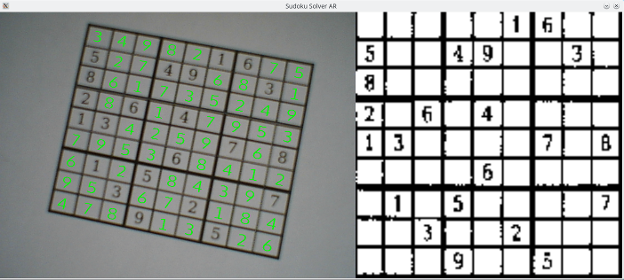

# Sudoku Solver AR

**Sudoku Solver AR** is an augmented reality Sudoku solver. It captures video using a camera, finds Sudoku puzzles in the video, and then displays answers to those puzzles in such a way that they look like they are part of the original scene.

All of the image processing and computer vision code is written from scratch and does not use any external libraries.



## Progress

* [x] Capture video from webcam
* [x] Preprocess image processing
* [x] Line detection
* [x] Puzzle detection
* [x] Puzzle dewarp
* [X] OCR numbers
* [x] Solve puzzle
* [x] Render puzzle solution
* [x] Composite solution over original puzzle

## Building and Running

### Linux

Requirements

* [CMake](https://cmake.org/) >= 3.6.2
* GCC >= 7.1.1 OR clang >= 4.0.0
* [GLFW](http://www.glfw.org/) >= 3.2
* [glm](http://glm.g-truc.net/) >= 0.9.8
* mesa-libGL
* mesa-libGLES
* [freetype](https://www.freetype.org/) >= 2.6

Clone the source directory using:

`git clone https://github.com/jbendig/Sudoku-Solver-AR.git`

Change to the new directory and create a build directory:

```
cd Sudoku-Solver-AR
mkdir build
cd build
```

Configure the build:

`cmake ../`

Build:

`make`

Run (Make sure to connect a webcam first):

`make run`

### Windows

Requirements

* [CMake](https://cmake.org/) >= 3.6.2
* [Visual Studio](https://www.visualstudio.com/) >= 2017 (Older versions are not supported because C++17 support is required)
* [GLFW](http://www.glfw.org/) >= 3.2
* [GLEW](http://glew.sourceforge.net/) >= 2.0
* [glm](http://glm.g-truc.net/) >= 0.9.8
* [OpenGL ES 3.0 Headers](https://www.khronos.org/registry/OpenGL/index_es.php#headers3) (Make sure to get KHR/khrplatform.h on the same page)
* [freetype](https://www.freetype.org/) >= 2.6

Clone or download source code from:

`https://github.com/jbendig/Sudoku-Solver-AR.git`

Run CMake in the resulting directory and configure the following variables:

* **GLFW_INCLUDE_DIR**: GLFW include directory
* **GLFW_LIBRARY_DIR**: GLFW library directory
* **GLES3_INCLUDE_DIR**: OpenGL ES 3 include directory
* **GLEW_INCLUDE_DIR**: GLEW include directory
* **GLEW_LIBRARY_DIR**: GLEW library directory
* **GLM_INCLUDE_DIR**: GLM include directory
* **FREETYPE_INCLUDE_DIR_freetype2**: FreeType include directory
* **FREETYPE_INCLUDE_DIR_ft2build**: Set to the same as FREETYPE_INCLUDE_DIR_freetype2
* **FREETYPE_LIBRARY_DEBUG**: FreeType debug library
* **FREETYPE_LIBRARY_RELEASE**: FreeType release library

Open the `sudoku_solver_ar.sln` file in the build directory you selected with CMake. Then build and run using Visual Studio. Make sure to connect a supported webcam before running or else the program will fail to start.

## Instructions

Simply point your camera at a Sudoku puzzle. If a puzzle is found, green boxes will be shown on your screen indicating where it thinks the puzzle is. After a moment, these green boxes are replaced with numbers forming a solution to the puzzle. Check out the **Troubleshooting** section below for help.

Note: The neural network used for optical character recognition must be trained the first time the program is run. This process can take several hours! It will periodically save its progress so you can close the program and have it resume automatically on next run. I'll include a pre-trained data set in the future so eventually this part can be skipped.

## Controls

| **Key** | **Action** |
|---------|------------|
| Escape  | Close program |
| 0       | Toggle drawing of canny edge detection over output (Default: On) |
| 1       | Toggle drawing of hough transform (Default: Off) |
| 2       | Toggle drawing of detected lines over output (Default: Off) |
| 3       | Toggle drawing of detected lines colored by clustered orientation over output (Default: Off) |
| 5       | Toggle drawing of randomly generated puzzles used as input for training the neural network (Default: Off) |

## Camera Support

Camera support is currently extremely limited. Only cameras that output the following formats will work.

| **Linux** | **Windows** |
|-----------|-------------|
| YUV 4:2:2 | NV12        |
|           | RGB24       |

## Troubleshooting

Sudoku Solver AR is fairly robust at recognizing puzzles under different lighting conditions and fonts. It can have problems if the surface the puzzle is printed on is warped or the camera is pointed at an extreme angle. Here's a list of things to try to improve recognition.

- Flatten the surface that the puzzle is printed on.
- Keep the camera parallel to the puzzle's surface.
- Move the camera closer to the puzzle.
- Use a higher resolution camera.

## Licensing

Sudoku Solver AR is dual licensed under both the MIT license and the Apache License (Version 2.0). Pick the license that is more convenient.

See [LICENSE-MIT](LICENSE-MIT) and [LICENSE-APACHE](LICENSE-APACHE).
